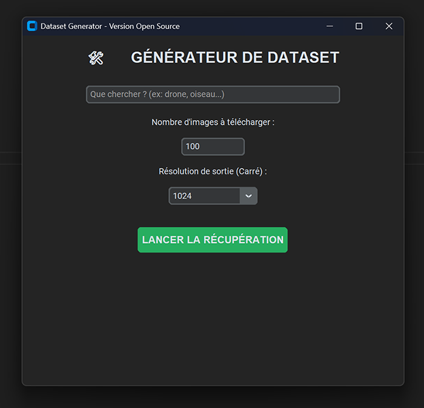

# 🛠️ Image Dataset Generator

A simple and efficient GUI-based tool to quickly create image datasets for AI training (YOLO, Stable Diffusion, etc.). It automates image downloading via Bing and performs square-format preprocessing.



## ✨ Features
* **Automated Search**: Uses `icrawler` to retrieve images from Bing.
* **Automatic Preprocessing**: Converts images to RGB and resizes them to square dimensions (416, 640, 1024, etc.).
* **Modern Interface**: Built with `customtkinter` for a sleek dark mode experience.
* **Clean Organization**: Automatically separates raw images (`raw`) from ready-to-use images (`processed`).

## 🚀 Installation

1. Clone the repository:
```bash
git clone [https://github.com/alexandre196/Dataset_Generator.git](https://github.com/alexandre196/Dataset_Generator.git)
Install the required dependencies:

Bash
pip install customtkinter icrawler Pillow
📋 How to Use
Run the script: python Dataset_Generator.py

Enter your keyword (e.g., "drones").

Select the number of images and the desired resolution.

Click on LANCER LA RÉCUPÉRATION (Start Download).

The images will be saved in the dataset_output/ folder.

⚖️ License & Responsibility
This tool is intended for educational and research purposes. The user is responsible for verifying the usage rights of the downloaded images.
